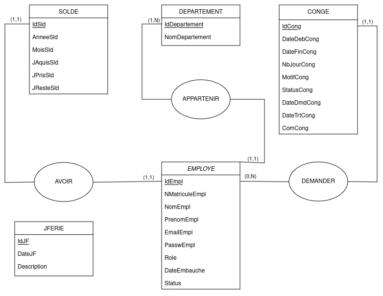
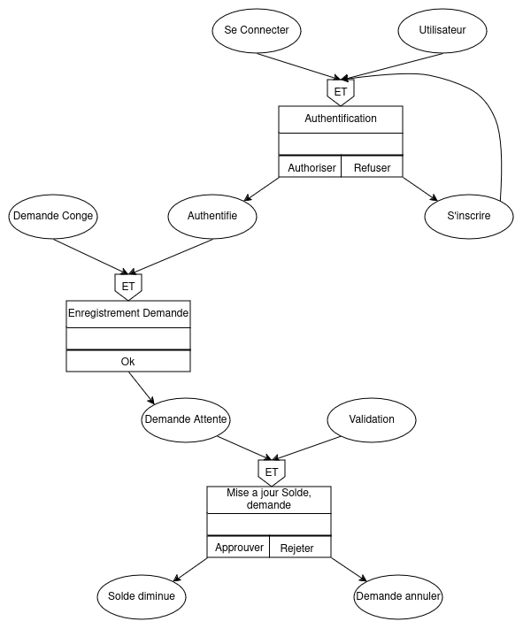

<h1 align="center">EMPLOYE LEAVE MANAGEMENT</h1>

<h2 align="center">Methode MERISE</h2>

## Regle de Gestion
**RG 1:**
* Un **Employe**  appartient *un et un seul* **Departement**.
* Il est Connue par son *IdEmpl, NMatriculeEmpl, NomEmpl, PrenomEmpl, EmailEmpl, PasswEmpl, Role, DateEmbauche, Status.*

**RG 2:**
* Un **Departement** *peux avoir plusieurs* **Employe**.
* Un departement est caracterise par son *IdDepartement, NomDepartement*.

**RG 3:**
* Un **Employe** peut demande *un ou plusieurs* **Conge**.

**RG 4:**
* Un **Conge** correspond a *un et un seul* **Employe**. 
* Un **Conge** est represente par son *IdCong, DateDebCong, DateFinCong, NbJourCong, MotifCong, StatusCong, DateDmdCong, DateTrtCong, ComCong.*

**RG 5:**
* Un **Employe** doit avoir *un ou plusieurs* **Solde** de Conge.

**RG 6:**
* Un **Solde** de conge appartient a *un et un seul* **Employe**.
* Il est identifie par *IdSld, AnneeSld, MoisSld, JAquisSld, JPrisSld, JResteSld.*

**RG 7:**
* Pour chaque connexion, l'utilisateur doit s'authentifier.

**RG 8:**
* A chaque demande de conge apres l'authentification, On doit enregistrer les information de la demande et le mettre en attente.

**RG 9:**
* Pour chaque validation des demande en attent, On doit mettre a jour son solde et son demande de Conge.

## Modele Conceptuel de Donnee

## Modele Logique de Donnee

* **EMPLOYE** (IdEmpl, NomEmpl, PrenomEmpl, EmailEmpl, PasswEmpl, Role, DateEmbauche, ServiceEmpl, Status);

* **CONGE** (IdConge, DateDebCong, NbJourCong, MotifCong, StatusCong, DateDmdCong, DateTrtCong, ComCong, **#IdEmpl**);

* **SOLDE** (IdSld, AnneeSld, MoisSld, JAquisSld, JPrisSld, JResteSld, **IdEmpl**);

* **JFERIE** (IdJF, DateJF, Description);

## Modele Conceptuel de Traitement

## Modele Conceptuel de Traitement Analytics